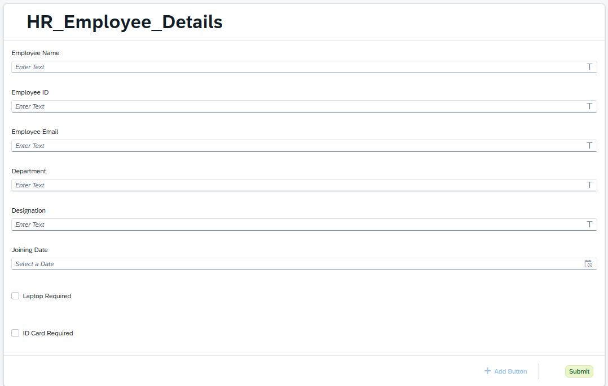
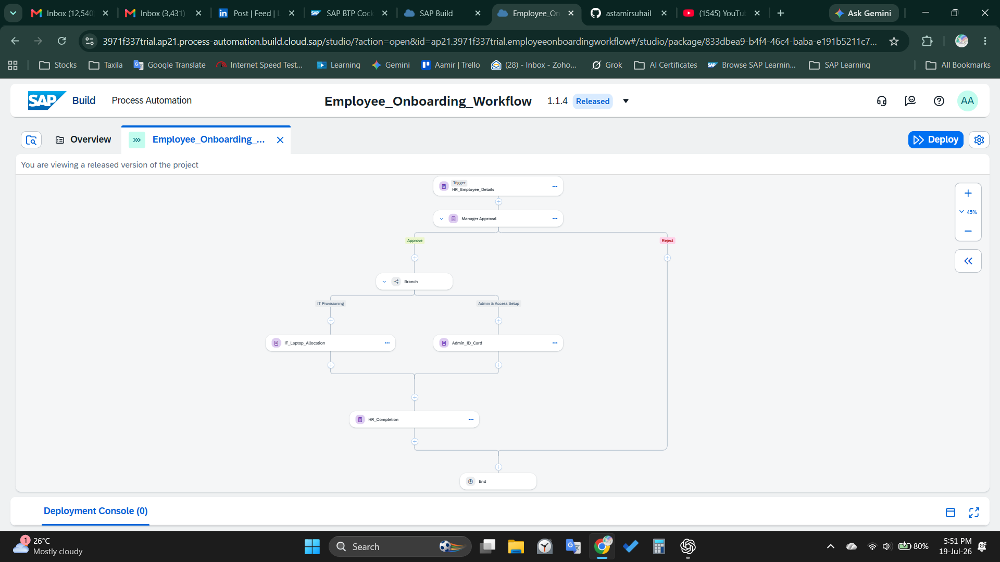
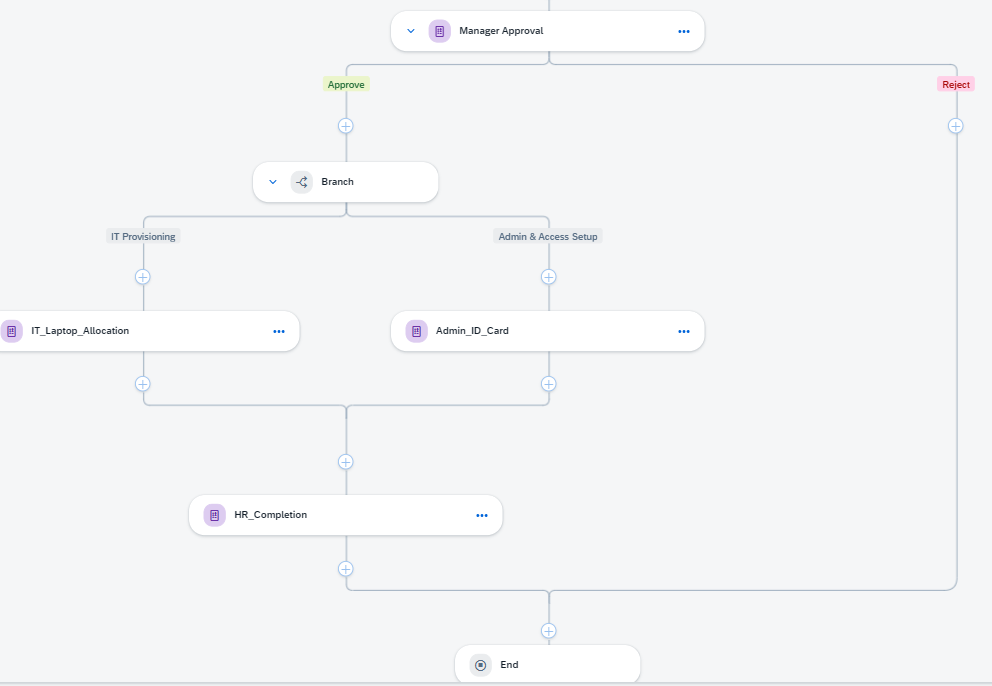
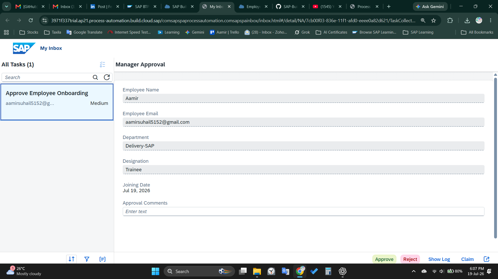
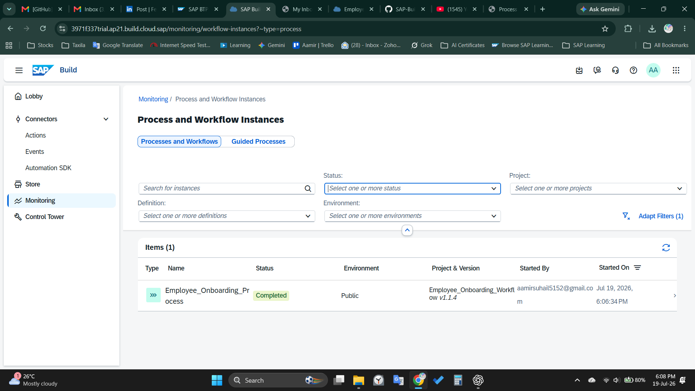

# Employee Onboarding Workflow using SAP Build Process Automation


---

## Overview

This project demonstrates an **Employee Onboarding Workflow** developed using **SAP Build Process Automation (SAP Build BPA)** on **SAP Business Technology Platform (SAP BTP)**.

The workflow automates the employee onboarding lifecycle from HR data collection to manager approval, parallel onboarding activities, and HR completion.

The project showcases practical enterprise workflow automation concepts including human approvals, parallel task execution, dynamic data mapping, SAP Inbox integration, and workflow monitoring.

---

# Business Scenario

When a new employee joins an organization:

- HR submits employee details.
- Manager reviews the onboarding request.
- After approval:
  - IT allocates a laptop.
  - Administration prepares the employee ID card.
- Both activities execute simultaneously.
- HR completes the onboarding process.
- Workflow ends successfully.

---

# Workflow Architecture

```text
Employee Information Form
           │
           ▼
Manager Approval
           │
      Approved
           │
      ┌────┴────┐
      │         │
      ▼         ▼
IT Laptop   Admin ID Card
Allocation     Setup
      │         │
      └────┬────┘
           ▼
      HR Completion
           │
           ▼
          End
```

---

# Features

- Employee Details Form
- Manager Approval
- Dynamic Data Mapping
- Auto-filled Forms
- Parallel Task Execution
- SAP Inbox Integration
- Workflow Monitoring
- Process Deployment
- Public Form Trigger

---

# Technologies Used

| Technology | Purpose |
|------------|---------|
| SAP Build Process Automation | Workflow Development |
| SAP BTP | Cloud Platform |
| SAP Build Forms | Forms |
| SAP Workflow | Process Automation |
| SAP Build Inbox | Task Management |
| SAP Monitoring | Process Monitoring |

---

# Workflow Steps

### Step 1

HR submits Employee Details.

---

### Step 2

Manager reviews and approves the onboarding request.

---

### Step 3

After approval, two onboarding tasks run simultaneously.

- IT Laptop Allocation
- Admin ID Card Setup

---

### Step 4

After both tasks finish, HR completes onboarding.

---

### Step 5

Workflow completes successfully.

---

# Screenshots

## HR Employee Details Form



---

## Workflow Design



---

## Parallel Branch Execution



---

## Manager Approval



---

## Workflow Monitoring



---

# Project Structure

```
SAP-Build-Employee-Onboarding-Workflow
│
├── README.md
├── Screenshots
│   ├── 01_HR_Form.png
│   ├── 02_Workflow_Design.png
│   ├── 03_Parallel_Branch.png
│   ├── 04_Manager_Approval.png
│   └── 05_Workflow_Monitoring.png
│
└── Documentation
    └── Employee_Onboarding_Workflow.pdf
```

---

# Key Learning Outcomes

- SAP Build Process Automation
- SAP Business Technology Platform
- Workflow Development
- Human Approval Process
- Dynamic Form Mapping
- Parallel Branching
- SAP Inbox
- Process Monitoring
- Workflow Deployment
- Business Process Automation

---

# Challenges Solved

- Implemented dynamic data mapping between forms.
- Configured parallel task execution after approval.
- Debugged deployment and workflow configuration issues.
- Tested end-to-end workflow execution.
- Integrated SAP Inbox tasks with workflow.

---

# Future Enhancements

- SMTP Email Notifications
- SAP SuccessFactors Integration
- SAP S/4HANA Integration
- Business Rules
- Role-Based Assignment
- Dashboard Analytics
- Notification Center Integration

---

# Author

**Aamir Suhail**

PGDM | Operations & Business Analytics

SAP Build Process Automation | SAP BTP | Business Process Automation

LinkedIn:
https://www.linkedin.com/in/astamirsuhail/

---

## License

This project is created for learning and portfolio purposes.
